# LensHub Use Case Diagram

## Documentation Maintenance

**Last Updated:** 2026-06-10  
**Document Version:** 1.0  
**Maintained By:** Development Team

## Scope

Use case diagram tong hop cho cac yeu cau chuc nang:

- Guest: G-01 den G-03
- Customer: C-01 den C-05
- Staff/Admin: A-01 den A-04
- Super Admin: SA-01
- External systems: VNPay, Mail Service

## Diagram

```plantuml
@startuml
left to right direction
skinparam packageStyle rectangle
skinparam actorStyle awesome

actor Guest
actor Customer
actor "Staff/Admin" as StaffAdmin
actor "Super Admin" as SuperAdmin
actor VNPay
actor "Mail Service" as MailService

Customer --|> Guest
SuperAdmin --|> StaffAdmin

rectangle "LensHub System" {
  usecase "G-01\nXem catalog" as G01
  usecase "Xem trang chủ" as G01_Home
  usecase "Xem danh sách sản phẩm" as G01_List
  usecase "Xem chi tiết sản phẩm" as G01_Detail
  usecase "Xem review" as G01_Review
  usecase "Kiểm tra tình trạng có thể thuê" as G01_Availability

  usecase "G-02\nĐăng ký/kích hoạt" as G02
  usecase "Tạo tài khoản" as G02_Register
  usecase "Kích hoạt qua email" as G02_Activate
  usecase "Gửi email kích hoạt" as Mail_Activation

  usecase "G-03\nGửi hỗ trợ" as G03
  usecase "Gửi support ticket công khai" as G03_PublicTicket

  usecase "C-01\nXác thực" as C01
  usecase "Đăng nhập" as C01_Login
  usecase "Refresh session" as C01_Refresh
  usecase "Đăng xuất" as C01_Logout
  usecase "Quên/reset mật khẩu" as C01_ResetPassword
  usecase "Gửi email reset mật khẩu" as Mail_Reset

  usecase "C-02\nQuản lý hồ sơ" as C02
  usecase "Cập nhật thông tin cá nhân" as C02_Profile
  usecase "Cập nhật avatar" as C02_Avatar
  usecase "Quản lý địa chỉ" as C02_Address

  usecase "C-03\nMua hàng" as C03
  usecase "Quản lý giỏ hàng" as C03_Cart
  usecase "Áp voucher" as C03_Voucher
  usecase "Checkout mua hàng" as C03_Checkout
  usecase "Thanh toán VNPay đơn mua" as Pay_Purchase
  usecase "Theo dõi đơn mua" as C03_TrackOrder

  usecase "C-04\nThuê thiết bị" as C04
  usecase "Tạo đơn thuê" as C04_CreateRental
  usecase "Ký hợp đồng thuê" as C04_SignContract
  usecase "Thanh toán phí thuê VNPay" as Pay_Rental
  usecase "Theo dõi đơn thuê" as C04_TrackRental

  usecase "C-05\neKYC" as C05
  usecase "Upload giấy tờ/selfie" as C05_Upload
  usecase "Submit hồ sơ eKYC" as C05_Submit
  usecase "Xem trạng thái duyệt eKYC" as C05_Status

  usecase "A-01\nQuản lý catalog" as A01
  usecase "Tạo/sửa/xóa/khôi phục sản phẩm" as A01_Product
  usecase "Quản lý danh mục" as A01_Category
  usecase "Quản lý ảnh/gallery" as A01_Gallery
  usecase "Quản lý giá" as A01_Price

  usecase "A-02\nQuản lý tồn kho" as A02
  usecase "Điều chỉnh tồn kho bán" as A02_SaleStock
  usecase "Điều chỉnh tồn kho thuê" as A02_RentalStock
  usecase "Điều chỉnh tồn kho tổng" as A02_TotalStock
  usecase "Xem audit log tồn kho" as A02_Audit

  usecase "A-03\nQuản lý đơn" as A03
  usecase "Xem/cập nhật đơn mua" as A03_PurchaseOrder
  usecase "Xử lý vòng đời đơn thuê" as A03_RentalLifecycle

  usecase "A-04\nQuản trị hỗ trợ" as A04
  usecase "Xử lý support ticket" as A04_Ticket
  usecase "Duyệt review" as A04_Review
  usecase "Duyệt eKYC" as A04_Ekyc
  usecase "Xem audit log" as A04_Audit

  usecase "SA-01\nQuản lý RBAC" as SA01
  usecase "Quản lý user" as SA01_User
  usecase "Quản lý role" as SA01_Role
  usecase "Quản lý permission" as SA01_Permission
  usecase "Gán permission cho role" as SA01_AssignPermission
}

Guest --> G01
Guest --> G02
Guest --> G03

Customer --> C01
Customer --> C02
Customer --> C03
Customer --> C04
Customer --> C05

StaffAdmin --> A01
StaffAdmin --> A02
StaffAdmin --> A03
StaffAdmin --> A04

SuperAdmin --> SA01

VNPay --> Pay_Purchase
VNPay --> Pay_Rental
MailService --> Mail_Activation
MailService --> Mail_Reset

G01 ..> G01_Home : <<include>>
G01 ..> G01_List : <<include>>
G01 ..> G01_Detail : <<include>>
G01 ..> G01_Review : <<include>>
G01 ..> G01_Availability : <<include>>

G02 ..> G02_Register : <<include>>
G02 ..> G02_Activate : <<include>>
G02_Activate ..> Mail_Activation : <<include>>

G03 ..> G03_PublicTicket : <<include>>

C01 ..> C01_Login : <<include>>
C01 ..> C01_Refresh : <<include>>
C01 ..> C01_Logout : <<include>>
C01 ..> C01_ResetPassword : <<extend>>
C01_ResetPassword ..> Mail_Reset : <<include>>

C02 ..> C02_Profile : <<include>>
C02 ..> C02_Avatar : <<include>>
C02 ..> C02_Address : <<include>>

C03 ..> C03_Cart : <<include>>
C03 ..> C03_Voucher : <<include>>
C03 ..> C03_Checkout : <<include>>
C03 ..> Pay_Purchase : <<include>>
C03 ..> C03_TrackOrder : <<include>>

C04 ..> G01_Availability : <<include>>
C04 ..> C04_CreateRental : <<include>>
C04 ..> C04_SignContract : <<include>>
C04 ..> Pay_Rental : <<include>>
C04 ..> C04_TrackRental : <<include>>

C05 ..> C05_Upload : <<include>>
C05 ..> C05_Submit : <<include>>
C05 ..> C05_Status : <<include>>

A01 ..> A01_Product : <<include>>
A01 ..> A01_Category : <<include>>
A01 ..> A01_Gallery : <<include>>
A01 ..> A01_Price : <<include>>

A02 ..> A02_SaleStock : <<include>>
A02 ..> A02_RentalStock : <<include>>
A02 ..> A02_TotalStock : <<include>>
A02 ..> A02_Audit : <<include>>

A03 ..> A03_PurchaseOrder : <<include>>
A03 ..> A03_RentalLifecycle : <<include>>

A04 ..> A04_Ticket : <<include>>
A04 ..> A04_Review : <<include>>
A04 ..> A04_Ekyc : <<include>>
A04 ..> A04_Audit : <<include>>

SA01 ..> SA01_User : <<include>>
SA01 ..> SA01_Role : <<include>>
SA01 ..> SA01_Permission : <<include>>
SA01 ..> SA01_AssignPermission : <<include>>

@enduml
```

## Notes

- Customer ke thua Guest vi customer van co the xem catalog, review, tinh trang thue.
- Super Admin ke thua Staff/Admin vi co the thuc hien cac chuc nang quan tri noi bo va them RBAC.
- VNPay va Mail Service la actor ngoai he thong.
- Redis/token blacklist khong dua vao diagram nay vi la ha tang ky thuat, nen the hien trong architecture/sequence diagram neu can.

## Unresolved Questions

- Staff va Admin co can tach quyen rieng khong?
- Co can them actor Shipper/Delivery cho vong doi don hang khong?
