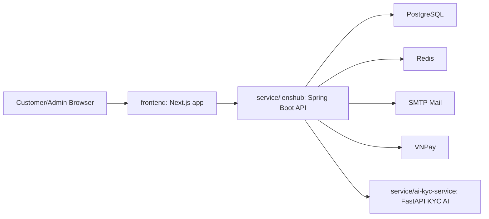
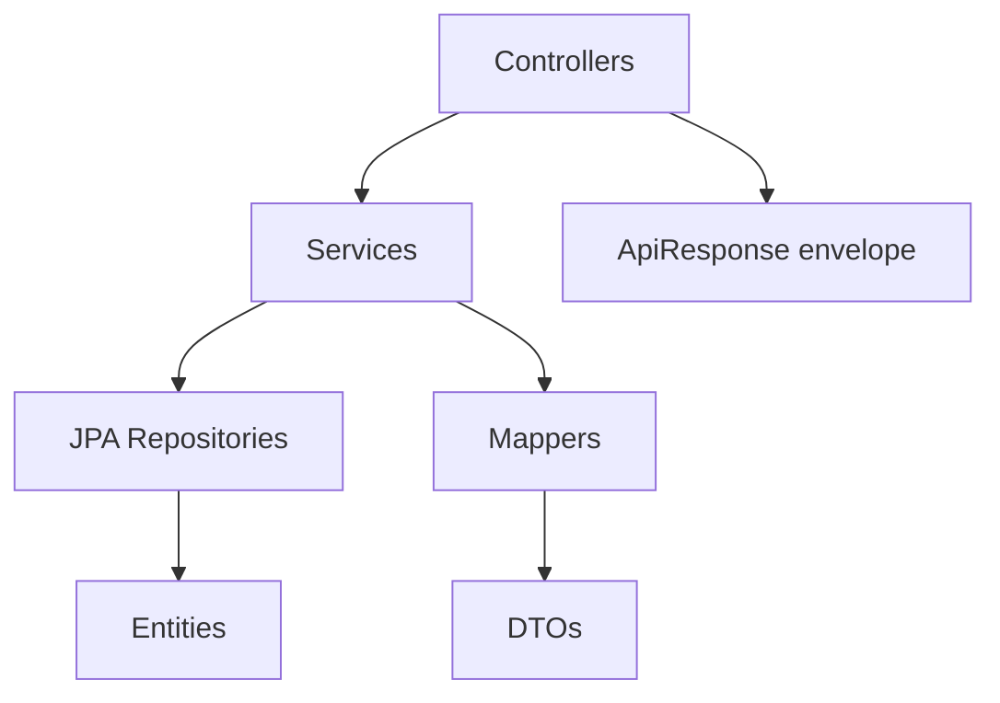
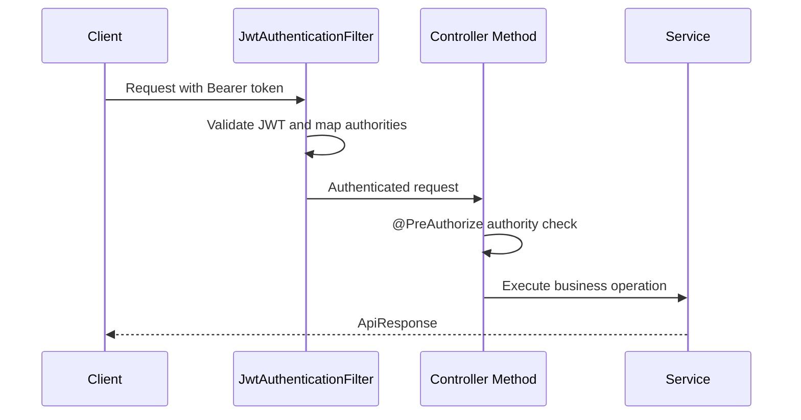
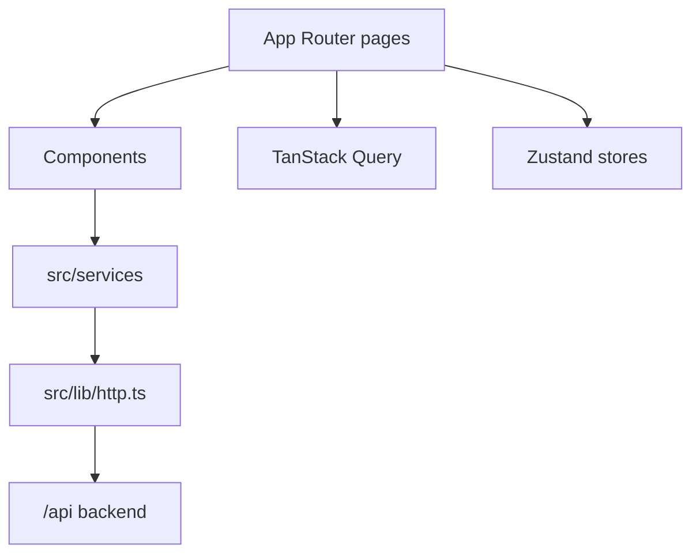

# System Architecture

## Documentation Maintenance
**Last Updated:** 2026-06-06  
**Document Version:** 1.0  
**Maintained By:** Development Team

## Overview

The system is a monorepo with a primary Spring Boot backend and a Next.js frontend application. The backend exposes REST APIs under `/api`. The Next.js frontend is the current customer/admin interface.

## Backend Runtime

- Application: `service/lenshub`
- Main class: `org.web.Main`
- Runtime: Java 17
- Framework: Spring Boot 4.0.3
- HTTP port: `8080`
- Context path: `/api`
- Database: PostgreSQL
- Cache/token blacklist support: Redis
- API docs: springdoc OpenAPI under Swagger paths allowed by security config

## Backend Layers

The backend follows module-first organization. Each feature module owns its controllers, services, repositories, models, DTOs, and mappers.

## Security Architecture

Security facts verified in `SecurityConfig`:

- CSRF disabled for stateless API behavior.
- Session policy is `STATELESS`.
- JWT filter runs before `UsernamePasswordAuthenticationFilter`.
- Method security is enabled with `@EnableMethodSecurity(prePostEnabled = true)`.
- CORS allows `http://localhost:3000`.
- Public endpoints include auth, uploads, OpenAPI/Swagger, product/category reads, product review reads, VNPay routes, and public support ticket creation.

## Data Architecture

The primary backend uses JPA/Hibernate and PostgreSQL. Entity modules include users, roles, permissions, products, categories, carts, sales orders, rental orders, devices, payments, inventory audit logs, vouchers, reviews, identity verification, support tickets, shipping addresses, and audit logs.

Development defaults in `application.yml` expect:

- PostgreSQL host port `5433`
- Redis host port `6379`

`application.yml` imports optional `.env` properties. No verified PostgreSQL compose file exists for the active backend. `docker/docker-compose.yml` is a legacy MySQL CMS compose, and `deploy/redis/docker-compose.yml` publishes Redis on `16379` with password settings that do not currently match backend defaults.

## API Architecture

All JSON responses should use `ApiResponse<T>`:

- `statusCode`
- `message`
- `success`
- `data`
- optional `pagination`
- optional `meta`

Pagination uses Spring `Page<T>` and is mapped to page number, page size, total pages, and total elements.

## Frontend Architecture: `frontend`

Key patterns:

- `src/app/layout.tsx` sets root layout and Inter typography.
- `src/app/providers.tsx` wires theme, query client, session guard, loading overlay, and toaster.
- `src/lib/http.ts` manages axios request auth headers, token refresh queue, and loading state.
- `NEXT_PUBLIC_API_URL` controls API base URL.

## Integration Points

- VNPay: `/payments/vnpay/create` and `/payments/vnpay/return`.
- Rental VNPay: `/payments/vnpay/rental-fee/create` and `/payments/vnpay/rental-fee/return`.
- eKYC: `/ekyc/ocr-preview`, `/ekyc/upload-liveness-video`, and `/ekyc/submit` support CCCD OCR preview, selfie facematch, and mandatory liveness video validation through the configured KYC provider.
- Mail: activation and password reset flows use SMTP configuration.
- Redis: token blacklist/cache support.
- OpenAPI: Swagger UI and API docs paths are public.

## eKYC Provider Configuration

`service/lenshub` selects provider by `APP_KYC_PROVIDER` with `mock` as default. FPT sandbox integration uses:

- `FPT_KYC_API_KEY`
- `FPT_KYC_IDR_URL`
- `FPT_KYC_FACEMATCH_URL`
- `FPT_KYC_LIVENESS_URL`

OCR preview is persisted in existing verification result data. Final submit reuses OCR preview, runs facematch, requires `livenessVideoUrl`, runs liveness validation, then keeps manual review as final authority.

For self-hosted local AI execution, `service/ai-kyc-service` can replace FPT network calls while keeping the same Spring provider contract. Point the three FPT URL variables to the FastAPI service:

- `FPT_KYC_IDR_URL=http://kyc-ai-service:8000/vision/idr/vnm/`
- `FPT_KYC_FACEMATCH_URL=http://kyc-ai-service:8000/dmp/checkface/v1`
- `FPT_KYC_LIVENESS_URL=http://kyc-ai-service:8000/dmp/liveness/v3`

The service is CPU-only in MVP. OCR, facematch, and liveness model integrations are lazy/optional so deployment can start with the FPT-compatible facade and evolve with representative CCCD/selfie/liveness test data.

## Architecture Risks

- Development secrets and credentials are present in configuration files and should be externalized before production use.
- Legacy migration assets may confuse setup unless ownership is clarified.
- Redis deployment config and backend Redis defaults do not currently line up.
