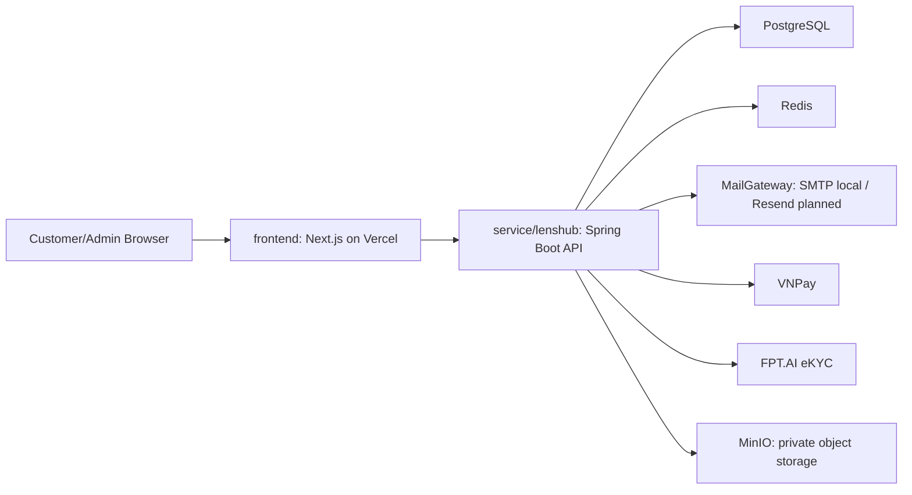
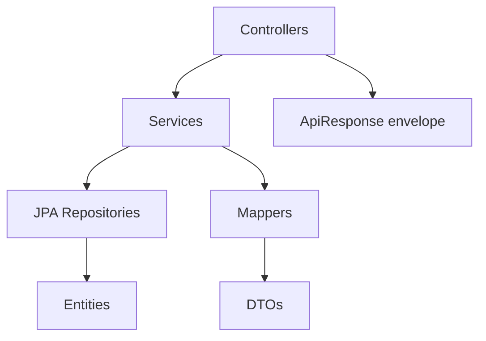
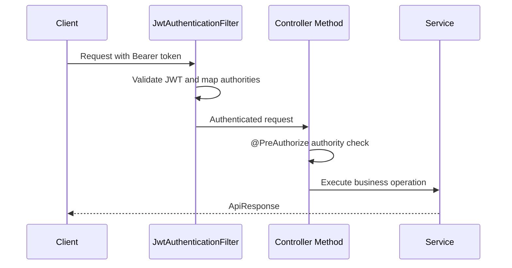
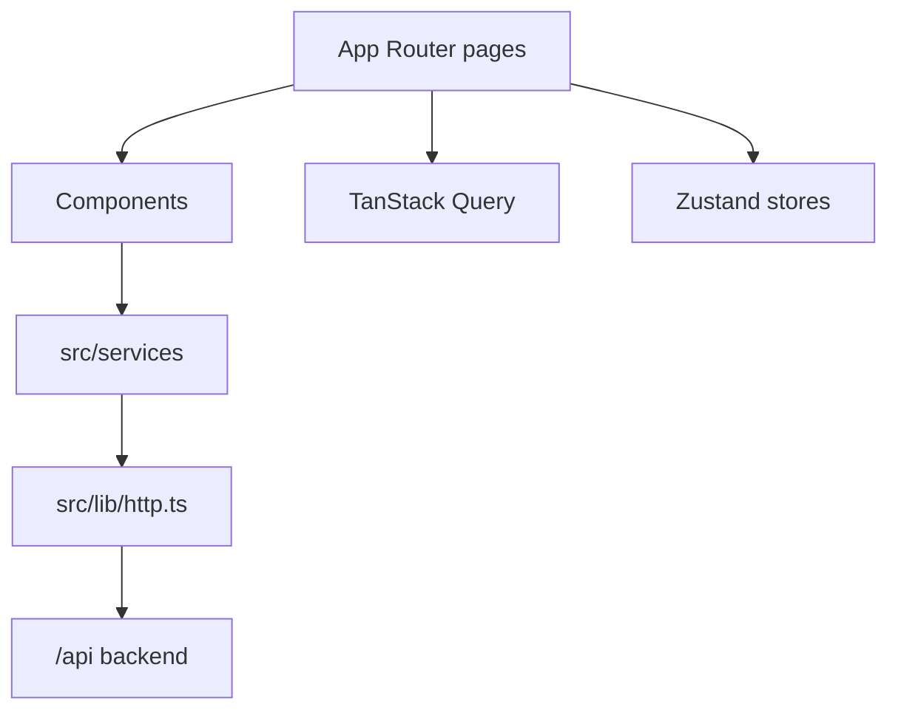

# System Architecture

## Documentation Maintenance
**Last Updated:** 2026-06-28
**Document Version:** 1.1
**Maintained By:** Development Team

## Overview

The system is a monorepo with a primary Spring Boot backend and a Next.js frontend application. The backend exposes REST APIs under `/api`. The Next.js frontend is the current customer/admin interface.

## Backend Runtime

- Application: `service/lenshub`
- Main class: `org.web.Main`
- Runtime: Java 17
- Framework: Spring Boot 4.0.3
- HTTP port: `8080`
- Context path: `/api`
- Database: PostgreSQL
- Cache/token blacklist support: Redis
- API docs: springdoc OpenAPI under Swagger paths allowed by security config
- Production migrations: Flyway V1+, then Hibernate schema validation
- Health: `/api/actuator/health`, `/liveness`, `/readiness`

## Backend Layers

The backend follows module-first organization. Each feature module owns its controllers, services, repositories, models, DTOs, and mappers.

## Security Architecture

Security facts verified in `SecurityConfig`:

- CSRF disabled for stateless API behavior.
- Session policy is `STATELESS`.
- JWT filter runs before `UsernamePasswordAuthenticationFilter`.
- Method security is enabled with `@EnableMethodSecurity(prePostEnabled = true)`.
- CORS allows `https://www.lenshub.shop`.
- Public endpoints include auth, uploads, OpenAPI/Swagger, product/category reads, product review reads, VNPay routes, and public support ticket creation.
- Health status and probe endpoints are public without details; component health paths remain authenticated.
- Production disables Swagger/OpenAPI.
- Access JWT and activation JWT use separate signing secrets.

## Data Architecture

The primary backend uses JPA/Hibernate and PostgreSQL. Entity modules include users, roles, permissions, products, categories, carts, sales orders, rental orders, devices, payments, inventory audit logs, vouchers, reviews, identity verification, support tickets, shipping addresses, and audit logs.

Development defaults in `application.yml` expect:

- PostgreSQL host port `5433`
- Redis host port `6379`

`application.yml` imports optional `.env` properties. Local `docker/docker-compose.yml` provides PostgreSQL, Redis, and MinIO. A dedicated production Compose stack is planned but not implemented.

Production activates `application-prod.yml`, enables Flyway, applies migrations before JPA initialization, and uses Hibernate `ddl-auto=validate`. Existing non-empty databases require an explicit reviewed Flyway baseline; automatic baseline remains disabled by default.

MinIO local infrastructure is configured in `docker/docker-compose.yml`. It exposes the S3 API on `9000` and Console on `9001`; `minio-init` creates the private `rental-assets` bucket and applies browser CORS for the local frontend. Backend configuration distinguishes `MINIO_INTERNAL_ENDPOINT` for backend object operations from `MINIO_PUBLIC_ENDPOINT` embedded in browser-facing presigned URLs. KYC and product-media clients upload directly to MinIO using short-lived PUT URLs; the backend persists asset metadata and generates short-lived GET URLs.

## API Architecture

All JSON responses should use `ApiResponse<T>`:

- `statusCode`
- `message`
- `success`
- `data`
- optional `pagination`
- optional `meta`

Pagination uses Spring `Page<T>` and is mapped to page number, page size, total pages, and total elements.

## Frontend Architecture: `frontend`

Key patterns:

- `src/app/layout.tsx` sets root layout and Inter typography.
- `src/app/providers.tsx` wires theme, query client, session guard, loading overlay, and toaster.
- `src/lib/http.ts` manages axios request auth headers, token refresh queue, and loading state.
- `NEXT_PUBLIC_API_URL` controls API base URL.

## Integration Points

- Private file storage: authenticated `POST /files/presign-upload`, `POST /files/{assetId}/complete`, `GET /files/{assetId}/download-url`, and `DELETE /files/{assetId}` manage `FileAsset` metadata and short-lived MinIO URLs. Clients upload bytes directly to MinIO with the returned presigned PUT URL; existing eKYC/product multipart flows are migrated in later phases.
- VNPay: `/payments/vnpay/create` and `/payments/vnpay/return`.
- Rental VNPay: `/payments/vnpay/rental-fee/create` and `/payments/vnpay/rental-fee/return`.
- eKYC: `/ekyc/ocr-preview` and `/ekyc/submit` receive private `FileAsset` IDs for new flows. The provider resolves object keys into temporary local files, validates liveness signature/duration, and removes temporary files after use. Legacy multipart endpoints remain only for rollout compatibility.
- Mail: `MailService` builds existing HTML templates and delegates delivery to
  `MailGateway`; SMTP is the current local adapter and Resend HTTPS is the next
  production phase.
- Redis: token blacklist/cache support.
- OpenAPI: Swagger UI and API docs paths are public.

## eKYC Provider Configuration

Local/default configuration selects provider through `APP_KYC_PROVIDER` with `mock` as default. The production profile fixes the provider to FPT and requires:

- `FPT_KYC_API_KEY`
- `FPT_KYC_IDR_URL`
- `FPT_KYC_FACEMATCH_URL`
- `FPT_KYC_LIVENESS_URL`

OCR preview is persisted in existing verification result data. Final submit reuses OCR preview, runs facematch, requires `livenessVideoUrl`, runs liveness validation on the saved continuous video, then keeps manual review as final authority.

Self-hosted `service/ai-kyc-service` remains a development alternative and is not part of the current production topology.

- `FPT_KYC_IDR_URL=http://kyc-ai-service:8000/vision/idr/vnm/`
- `FPT_KYC_FACEMATCH_URL=http://kyc-ai-service:8000/dmp/checkface/v1`
- `FPT_KYC_LIVENESS_URL=http://kyc-ai-service:8000/dmp/liveness/v3`

The service is CPU-only in MVP. OCR, facematch, and liveness model integrations are lazy/optional so deployment can start with the FPT-compatible facade and evolve with representative CCCD/selfie/liveness test data.

## Architecture Risks

- Previously committed credentials may remain in Git history and must be rotated before production.
- Production configuration is fail-fast, but VPS secret storage is implemented in a later phase.
- Legacy migration assets may confuse setup unless ownership is clarified.
- Redis deployment config and backend Redis defaults do not currently line up.
