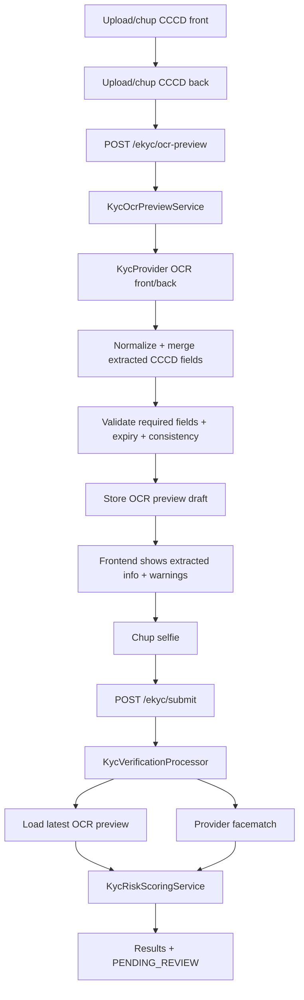

# Phase 01: OCR Preview + Facematch Manual Review

## Context Links

- Parent: [plan.md](plan.md)
- Research: [researcher-fpt-ekyc-sandbox.md](research/researcher-fpt-ekyc-sandbox.md)
- Analysis: [analysis-fpt-ekyc-codebase.md](reports/analysis-fpt-ekyc-codebase.md)

## Overview

**Date:** 2026-06-07
**Created By:** loc.nt <0905071704b@gmail.com>
**Priority:** High
**Implementation Status:** IMPLEMENTED - OCR preview after CCCD upload
**Review Status:** Awaiting review

Replace mock OCR/facematch with provider-backed MVP flow. Remove personal-info entry from customer flow. Backend extracts CCCD data from front/back images immediately after both CCCD images are uploaded, frontend shows extracted fields to the user, then final submit runs face match and keeps result in manual review.

## Key Insights

- Existing DB entities already support OCR, face, artifacts, risk.
- FPT requires API key on backend only.
- FPT Facematch expects 2 jpg/jpeg images.
- Current uploads are public; acceptable only for demo if explicitly accepted.
- UX requirement changed: extracted CCCD information must be shown before final submit, not only after submit/status.

## Requirements

- Configure FPT base URLs/API key by env.
- Create `KycProvider` interface and `FptKycProvider`.
- Add `MockKycProvider` fallback for tests/dev.
- Normalize OCR front/back into internal DTO.
- Add OCR preview endpoint after front/back upload.
- Frontend calls OCR preview when both CCCD front/back images are ready.
- Frontend displays extracted CCCD fields and validation warnings before selfie.
- User can retake front/back image if OCR result is missing/wrong.
- Validate extracted fields from OCR only; no user-entered identity fields in MVP.
- Cross-check front/back consistency where FPT returns side/type and issue/expiry fields.
- Validate required extracted fields: identity number, full name, date of birth, gender/nationality if available, residence/origin, issue/expiry dates when available.
- Save OCR preview draft or update existing `verification_results`.
- Final submit reuses latest OCR preview and calls face match selfie vs CCCD portrait.
- Save final OCR, face result, risk assessment.
- Always output `PENDING_REVIEW`.
- Customer can review extracted information before submit and after submit/status.
- Admin can see extracted data, score, validation warnings, and recommendation.

## Architecture

## Related Code Files

- `service/lenshub/src/main/java/org/web/identity/controller/EkycController.java`
- `service/lenshub/src/main/java/org/web/identity/service/IdentityService.java`
- `service/lenshub/src/main/java/org/web/identity/service/impl/IdentityServiceImpl.java`
- `service/lenshub/src/main/java/org/web/identity/service/KycOcrPreviewService.java`
- `service/lenshub/src/main/java/org/web/identity/service/KycVerificationProcessor.java`
- `service/lenshub/src/main/java/org/web/identity/dto/request/SubmitKycRequest.java`
- `service/lenshub/src/main/java/org/web/identity/dto/request/OcrPreviewRequest.java`
- `service/lenshub/src/main/java/org/web/identity/dto/response/KycOcrPreviewResponse.java`
- `service/lenshub/src/main/java/org/web/identity/dto/response/KycSessionResponse.java`
- `service/lenshub/src/main/resources/application.yml`
- `frontend/src/services/identity.ts`
- `frontend/src/app/(main)/profile/ekyc/page.tsx`
- `frontend/src/components/admin/KycManagement.tsx`

## Implementation Steps

1. Keep env config: `APP_KYC_PROVIDER`, `FPT_KYC_API_KEY`, `FPT_KYC_IDR_URL`, `FPT_KYC_FACEMATCH_URL`, timeout.
2. Add/keep provider DTOs for OCR/facematch normalized output.
3. Add/keep `KycProvider` interface.
4. Implement/keep `FptKycProvider` using Spring HTTP client.
5. Implement/keep `MockKycProvider` for no-key/dev mode.
6. Add `OcrPreviewRequest` with `frontImageUrl`, `backImageUrl`.
7. Add `KycOcrPreviewResponse` with extracted fields, OCR confidence, warnings, preview status.
8. Add `POST /ekyc/ocr-preview`.
9. Add `KycOcrPreviewService`:
   - resolve uploaded files
   - call OCR front/back
   - normalize/merge
   - validate required fields, expiry, consistency
   - persist preview draft or update `verification_results`
10. Change frontend flow:
   - Step 1 upload front
   - Step 2 upload back
   - call OCR preview
   - show extracted fields and warnings
   - allow retake front/back
   - continue to selfie only after preview is available, or allow continue with warning for manual review
11. Change `SubmitKycRequest` to no longer require identity fields; submit should use image URLs and latest OCR preview.
12. Change `KycVerificationProcessor` to load OCR preview and avoid re-running OCR unless preview missing/stale.
13. Final submit calls face match, computes risk, saves final result, returns `PENDING_REVIEW`.
14. Update admin response/UI to show extracted data, recommendation/reasons.
15. Add tests with fixture preview responses and missing-field scenarios.

## Todo List

- [x] OCR preview request/response DTOs.
- [x] OCR preview service.
- [x] `POST /ekyc/ocr-preview`.
- [x] Persist or upsert OCR preview result.
- [x] Submit uses OCR preview instead of re-running OCR.
- [x] Frontend call OCR preview after front/back upload.
- [x] Frontend extracted-info panel before selfie.
- [x] Retake front/back clears/reloads OCR preview.
- [x] Admin display still shows final OCR/risk data.
- [x] Backend tests.
- [x] Frontend lint/build.

## Success Criteria

- After uploading/chup CCCD front and back, frontend shows extracted CCCD information before selfie.
- User can retake front/back and OCR preview refreshes.
- Final submit with valid preview runs facematch and returns `PENDING_REVIEW`.
- Customer can complete KYC without typing CCCD personal info.
- OCR/facematch data visible in admin detail.
- Required-field/expired/duplicate validation produces warnings/risk reasons.
- FPT timeout returns controlled error or fallback based on config.
- No API key visible in frontend.

## Risk Assessment

| Risk | Probability | Impact | Mitigation |
| --- | --- | --- | --- |
| Sandbox key missing | Medium | High | Mock provider switch |
| OCR preview latency | Medium | Medium | Loading state, retry, timeout |
| Image format rejected | Medium | Medium | Convert/compress jpg before provider or reject early |
| OCR misses required fields | Medium | High | Show warnings, allow retake, mark manual review risk |
| User cannot correct OCR typo | Medium | Medium | Allow retake; admin can reject with reason; optional future correction flow |
| Duplicate result rows | Medium | Medium | Upsert preview/result by session id |

## Security Considerations

- Do not log raw images, API key, or full provider raw JSON.
- Avoid returning provider raw JSON to customer.
- Store only normalized OCR fields and summarized raw response if needed.
- Flag public upload path as not production-safe.

## Next Steps

- Implement OCR preview endpoint and frontend preview panel before continuing Phase 2.

## Unresolved Questions

- [ ] Store OCR preview in existing `verification_results` or add separate preview table/status?
- [ ] Should user be allowed to continue if OCR preview has high-risk warnings?
- [ ] Should Phase 1 include private storage?
- [ ] Exact FPT sandbox rate limits?
