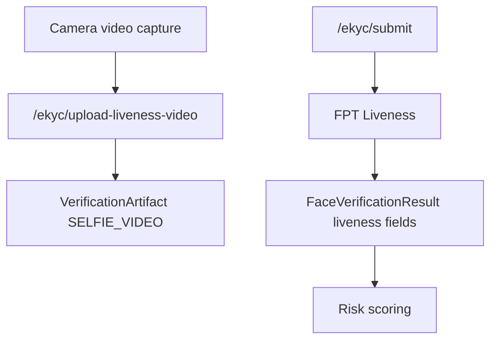

# Phase 02: FPT Liveness

## Context Links

- Parent: [plan.md](plan.md)
- Depends on: [phase-01-fpt-ocr-facematch-manual-review.md](phase-01-fpt-ocr-facematch-manual-review.md)

## Overview

**Date:** 2026-06-07
**Created By:** loc.nt <0905071704b@gmail.com>
**Priority:** Medium
**Implementation Status:** IN_PROGRESS - Step 4 reviewed, awaiting approval
**Review Status:** Self-reviewed, 0 critical issues

Add live face video capture and FPT Liveness validation.

## Key Insights

- FPT liveness requires short 5-6s video, 720p, 25fps, one frontal face.
- This is a larger UX change than Phase 1.
- Adds direct per-request cost.

## Requirements

- Capture selfie video in frontend.
- Upload liveness artifact to backend.
- Call FPT Liveness via provider.
- Save liveness score/pass/failure reason.
- Include liveness in risk scoring.
- Keep manual review final.

## Architecture

## Related Code Files

- `frontend/src/app/(main)/profile/ekyc/page.tsx`
- `frontend/src/services/identity.ts`
- `service/lenshub/src/main/java/org/web/identity/controller/EkycController.java`
- `service/lenshub/src/main/java/org/web/identity/model/FaceVerificationResult.java`
- `service/lenshub/src/main/java/org/web/identity/service/...`
- `service/lenshub/src/main/java/org/web/common/enums/VerificationArtifactType.java`

## Implementation Steps

1. Add liveness video upload endpoint.
2. Add frontend capture step after selfie or replace selfie with video+frame.
3. Validate file size/duration/type before upload.
4. Extend `KycProvider` with `verifyLiveness`.
5. Implement FPT liveness call.
6. Store liveness fields in `FaceVerificationResult`.
7. Update risk score: liveness fail => high risk.
8. Update admin detail to show liveness result.
9. Add tests and manual browser checks.

## Todo List

- [x] Video capture UX.
- [x] Upload endpoint.
- [x] Provider method.
- [x] Risk rule.
- [x] Admin UI.
- [x] Tests.

## Success Criteria

- User can record/upload 5-6s video.
- Backend records liveness pass/fail.
- Admin sees liveness decision.
- Liveness fail goes high-risk/manual reject recommendation.

## Risk Assessment

| Risk | Probability | Impact | Mitigation |
| --- | --- | --- | --- |
| Browser video support inconsistent | Medium | Medium | Feature detect and show fallback |
| Video cost increases | Medium | Medium | Phase flag, only call on submit |
| Large uploads | Medium | Medium | Client/server size limits |

## Security Considerations

- Video is more sensitive than selfie; private storage becomes strongly recommended.
- Signed URL/admin-only access before production.

## Next Steps

- Phase 3 waits for liveness telemetry and threshold confidence.

## Unresolved Questions

- [ ] Does FPT sandbox support liveness video in account?
- [ ] Browser target devices?
