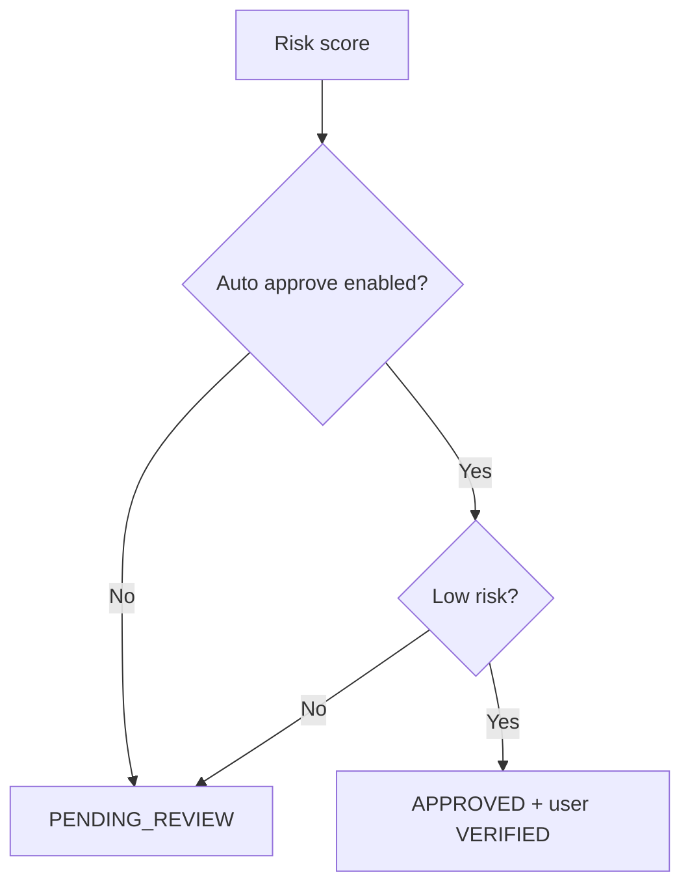

# Phase 03: Auto Approve Low-Risk

## Context Links

- Parent: [plan.md](plan.md)
- Depends on: [phase-01-fpt-ocr-facematch-manual-review.md](phase-01-fpt-ocr-facematch-manual-review.md)
- Optional dependency: [phase-02-fpt-liveness.md](phase-02-fpt-liveness.md)

## Overview

**Date:** 2026-06-07
**Created By:** loc.nt <0905071704b@gmail.com>
**Priority:** Medium
**Implementation Status:** Draft
**Review Status:** Not reviewed

Auto approve only low-risk sessions, with feature flag and audit trail.

## Key Insights

- Rental business risk is high; false approval can lead to asset loss.
- Auto approval should be feature-flagged and reversible.
- Manual review remains for medium/high risk.

## Requirements

- Add `KYC_AUTO_APPROVE_ENABLED`.
- Add threshold config.
- Auto approve only if:
  - OCR confidence high.
  - Required extracted fields are present and valid.
  - Front/back document data is internally consistent.
  - Document is not expired.
  - Facematch passed above threshold.
  - Liveness passed if enabled.
  - CCCD not duplicate.
  - No provider error.
- Save auto decision source and audit note.

## Architecture

## Related Code Files

- `IdentityServiceImpl.java`
- `KycRiskScoringService.java`
- `KycSessionResponse.java`
- `VerificationResult.java`
- `RiskAssessment.java`
- `UserIdentity.java`
- `AuditLog` module if used for decision logging.

## Implementation Steps

1. Add auto approve config properties.
2. Add deterministic threshold evaluator.
3. Reuse existing approve path to set `APPROVED`, `VERIFIED`, and save `UserIdentity`.
4. Add decision source `AI_AUTO_APPROVED` for auto pass.
5. Keep medium/high as `PENDING_REVIEW`.
6. Add admin filter badges for auto-approved/manual-review.
7. Add tests for thresholds and rollback flag.

## Todo List

- [ ] Feature flag.
- [ ] Threshold evaluator.
- [ ] Auto approve path.
- [ ] Audit note.
- [ ] Tests.
- [ ] Docs update.

## Success Criteria

- With flag off, behavior same as Phase 1/2.
- With flag on, only low-risk session becomes `APPROVED`.
- User can rent only after auto/manual approval.
- Medium/high still require admin.

## Risk Assessment

| Risk | Probability | Impact | Mitigation |
| --- | --- | --- | --- |
| False auto approval | Medium | High | Conservative thresholds, feature flag |
| Duplicate identity bypass | Low | High | Check `identityNumber` before approve |
| Rollback needed | Medium | Medium | Disable flag; manual review restored |

## Security Considerations

- Every auto approval must be auditable.
- Never auto approve provider error or partial result.
- Monitor approval/rejection rates after rollout.

## Next Steps

- Run with flag off in staging.
- Enable for small controlled set.

## Unresolved Questions

- [ ] Threshold values acceptable to business owner?
- [ ] Is auto approve allowed when user never manually confirms extracted OCR fields?
- [ ] Need notification email after auto approve/reject?
