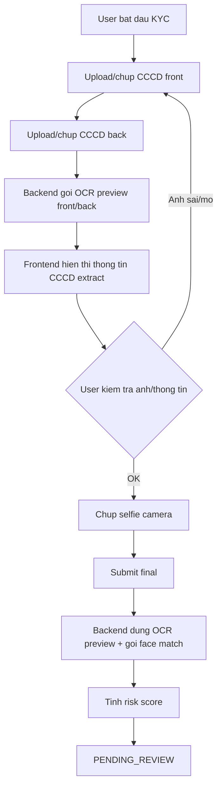

# Implementation Plan: FPT eKYC AI Integration

**Date:** 2026-06-07
**Created By:** loc.nt <0905071704b@gmail.com>
**Status:** In Progress - Phase 2 liveness implementation
**Complexity:** High
**Estimated Effort:** 40-60 hours

## Overview

Integrate FPT sandbox into current KYC flow in 3 phases: OCR preview after CCCD upload + Facematch with manual review, Liveness, then auto approve low-risk. New MVP removes manual personal-info entry: user only uploads/chup CCCD front, CCCD back, selfie; backend extracts identity data from CCCD images immediately after front/back are available and frontend shows extracted information for user review before final submit.

## Goals

- [ ] Phase 1: FPT ID OCR front/back immediately after CCCD upload, show extracted identity data on frontend, then Facematch on submit, all results still `PENDING_REVIEW`.
- [ ] Phase 2: Add liveness video capture and provider call.
- [ ] Phase 3: Auto approve only low-risk sessions.
- [ ] Preserve rental gate: only `user.kycStatus=VERIFIED` can rent.

## Proposed Architecture

`EkycController` -> `IdentityService` -> `KycOcrPreviewService` / `KycVerificationProcessor` -> `KycProvider` -> `FptKycProvider`

Provider returns normalized result DTOs. OCR preview service extracts and merges CCCD front/back data as soon as both images are uploaded/chosen, then frontend displays extracted fields and validation warnings. Final submit reuses the OCR preview result, runs selfie-vs-CCCD facematch, computes risk, and keeps admin approve/reject as final authority until Phase 3.

## Phase List

| Phase | Status | File |
| --- | --- | --- |
| 1. OCR preview + Facematch manual review | IMPLEMENTED - awaiting review | [phase-01-fpt-ocr-facematch-manual-review.md](phase-01-fpt-ocr-facematch-manual-review.md) |
| 2. FPT Liveness | IN_PROGRESS - Step 4 reviewed, awaiting approval | [phase-02-fpt-liveness.md](phase-02-fpt-liveness.md) |
| 3. Auto approve low-risk | Draft | [phase-03-auto-approve-low-risk.md](phase-03-auto-approve-low-risk.md) |

## Customer UX Flow

## Database Changes

- Add provider fields to existing result tables where missing: provider request id, raw response summary, extracted side, risk reasons.
- Add OCR preview persistence if needed:
  - MVP option: store preview in existing `verification_results` after front/back OCR, then update it on final submit.
  - Cleaner option: add `kyc_ocr_previews` or `ocr_preview_status` fields to separate draft OCR from final result.
- Add recommendation fields to session or risk assessment: `LOW/MEDIUM/HIGH`, `APPROVE/REVIEW/REJECT`.
- Keep data migration backward compatible; existing mock sessions remain readable.

## API Changes

- Keep existing `/ekyc/initiate`, `/ekyc/upload-front`, `/ekyc/upload-back`, `/ekyc/upload-selfie`, `/ekyc/submit`, `/ekyc/status`.
- Add OCR preview endpoint, preferred: `POST /ekyc/ocr-preview` with `frontImageUrl` and `backImageUrl`; response returns normalized extracted CCCD fields, OCR confidence, validation warnings, and preview status.
- Alternative acceptable MVP: upload endpoints return only image URL, and frontend calls `/ekyc/ocr-preview` after both front/back images are available.
- Change `/ekyc/submit` request to image/session driven. It should not require personal identity fields from user input.
- Change `/ekyc/submit` to include/resolve latest OCR preview result; it should not re-run OCR unless preview is missing/stale.
- Phase 2 adds selfie video upload or submit field for liveness artifact.
- Admin list/detail should show OCR, facematch, liveness, risk recommendation.

## Frontend Changes

- Step 1: upload/chup CCCD front.
- Step 2: upload/chup CCCD back.
- After Step 2 succeeds, call `/ekyc/ocr-preview`.
- Show extracted data before selfie:
  - So CCCD
  - Ho va ten
  - Ngay sinh
  - Gioi tinh
  - Quoc tich
  - Que quan
  - Noi thuong tru
  - Ngay cap
  - Ngay het han
  - OCR confidence and warnings
- User can retake front/back image if extracted data is missing or looks wrong.
- Step 3: capture selfie.
- Step 4: final review shows images + extracted OCR preview + submit button.

## Backend Processing

1. Upload front/back images as today.
2. Frontend calls `POST /ekyc/ocr-preview`.
3. Backend resolves private/local image paths.
4. Backend calls provider OCR for front/back.
5. Backend normalizes and merges extracted data.
6. Backend validates required fields, expiry, OCR confidence, and front/back consistency.
7. Backend stores OCR preview draft or updates `verification_results`.
8. Backend returns extracted fields and warnings to frontend.
9. Final submit receives image URLs/selfie URL, loads OCR preview, calls facematch, computes risk, saves final results, and returns `PENDING_REVIEW`.

## Key Risks

| Risk | Probability | Impact | Mitigation |
| --- | --- | --- | --- |
| FPT sandbox unavailable/quota exceeded | Medium | High | Feature flag + `MockKycProvider` fallback |
| OCR preview latency slows UX | Medium | Medium | Loading state, timeout, retry/retake option |
| Public KYC image access | High | High | MVP warning; private storage phase before production |
| False approval | Medium | High | Manual review until Phase 3, strict thresholds |
| Provider response schema mismatch | Medium | Medium | Contract DTOs + integration tests with fixtures |

## Validation

- Backend: `cd service/lenshub && .\gradlew test`
- Frontend: `cd frontend && pnpm lint && pnpm build`
- Manual: upload front/back then see extracted fields, retake bad image, missing OCR field, expired CCCD, face mismatch, duplicate CCCD, FPT timeout, final submit, admin approve/reject.

## References

- [Research report](research/researcher-fpt-ekyc-sandbox.md)
- [Codebase analysis](reports/analysis-fpt-ekyc-codebase.md)
- FPT ID Recognition: https://docs.fpt.ai/docs/en/vision/api/id-recognition
- FPT Facematch: https://docs.fpt.ai/docs/en/vision/api/face-match
- FPT Liveness: https://docs.fpt.ai/docs/en/vision/api/liveness

## Next Steps

1. Confirm FPT sandbox credentials and quota.
2. Implement Phase 1 revision: OCR preview endpoint + frontend extracted-info preview after CCCD upload.
3. Run `/code plans/2026-06-07-fpt-ekyc-ai-integration/plan.md` after approval.

## Unresolved Questions

- [ ] FPT sandbox account/API key ready?
- [ ] Implement private storage now or accept public upload risk for demo?
- [ ] Store OCR preview in existing `verification_results` or add separate preview table/status?
- [ ] Keep `/identity/ekyc/*` duplicate routes or deprecate?
